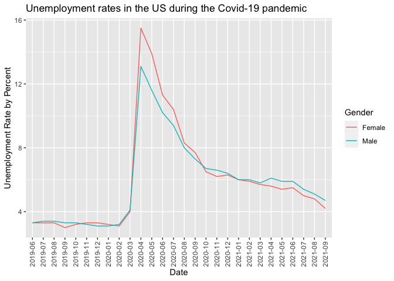

COVID-19 Team Beta Group Project
================
Shree, Andrew, Jack, Oscar, Kelly
2020-10-18

-   [Introduction](#introduction)
-   [Exploratory Data Analysis](#exploratory-data-analysis)
-   [Final Graphs](#final-graphs)
-   [Conclusion](#conclusion)
-   [Sources](#sources)

## Introduction

The Covid-19 pandemic was undoubtedly one of the most devastating and
destructive events any of us have witnessed at a global scale. However,
as with any other major crisis, the pandemic didn’t impact every
demographic the same. This project attempts to use exploratory data
analysis to answer the question, “how did the pandemic and its economic
consequences impact men and women differently in the United States?”.

According to a [policy brief published by the
UN](https://www.unwomen.org/-/media/headquarters/attachments/sections/library/publications/2020/policy-brief-the-impact-of-covid-19-on-women-en.pdf?la=en&vs=1406)
in April of 2020, women and girls experienced more negative economic
consequences, poorer health services (due to the reallocation of medical
resources and priorities), and an increase in gender-based violence
during the Covid-19 pandemic. An [article published by the McKinsey
company](https://www.mckinsey.com/featured-insights/future-of-work/covid-19-and-gender-equality-countering-the-regressive-effects)
stated similar statistics, citing that the majority of job losses were
experienced by women because of existing gender inequalities.

Both of these sources looked at how the pandemic impacted people
globally. Knowing what happened at a global scale, we were curious about
how these trends in gender disparities existed in the United States. Our
project uses datasets published by the CDC and Bureau of Labor
Statistics to examine how the pandemic impacted men and women
differently in the US.

## Exploratory Data Analysis

First, we load in the data we’ll be using.

``` r
df_unemploy <- read_csv("data/gender_and_unemployment.csv")
```

    ## Rows: 56 Columns: 3

    ## ── Column specification ────────────────────────────────────────────────────────
    ## Delimiter: ","
    ## chr (2): Date, Gender
    ## dbl (1): UnemploymentRate

    ## 
    ## ℹ Use `spec()` to retrieve the full column specification for this data.
    ## ℹ Specify the column types or set `show_col_types = FALSE` to quiet this message.

``` r
glimpse(df_unemploy)
```

    ## Rows: 56
    ## Columns: 3
    ## $ Date             <chr> "2021-01", "2021-02", "2021-03", "2021-04", "2021-05"…
    ## $ UnemploymentRate <dbl> 6.0, 6.0, 5.8, 6.1, 5.9, 5.9, 5.4, 5.1, 4.7, 3.1, 3.2…
    ## $ Gender           <chr> "Male", "Male", "Male", "Male", "Male", "Male", "Male…

The second figure we wanted to look at was Unemployment rates in the US
seperated by gender.

``` r
df_unemploy %>%
  ggplot() + 
  geom_line(aes(Date, UnemploymentRate, group = Gender, color = Gender)) + 
  theme(axis.text.x = element_text(angle = 90, vjust = 0.5, hjust=1)) + 
  labs(
    y = "Unemployment Rate by Percent", 
    title = "Unemployment rates in the US during the Covid-19 pandemic"
  )
```

<!-- -->
**Observations**: Unemployment rates were roughly the same for men and
women before the covid-19 pandemic, around 3%. During the pandemic, both
men and women experienced a drastic increase in unemployment rates,
however unemployment rates for women were about 3% higher than for men.
Around October of 2020, after unemployment rates decreased for both men
and women, trends returned to patterns we noticed before the pandemic,
where unemployment rates for both men and women are about the same.

## Final Graphs

## Conclusion

## Sources
